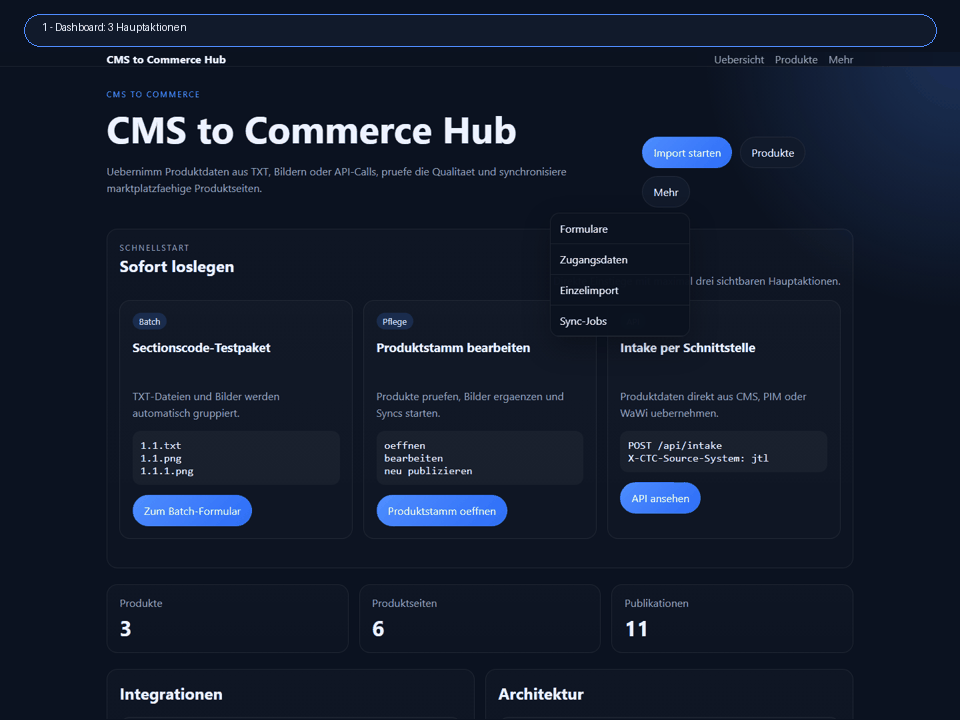

# CMS to Commerce Hub

[](https://github.com/roadynet/CmsToCommerce/actions/workflows/ci.yml)

Live-Demo: [cc.mcmonaco.de](https://cc.mcmonaco.de)

Symfony-Plattform für einen geschützten Produkt-Workflow von CMS-/Dateiimport bis zu marktplatzfähigen Amazon- und Shopware-Listings.



## Recruiter / Projektüberblick

Eine kompakte, GitHub-taugliche Projektvorstellung mit Screenshots, Tech-Stack, Architektur-Highlights und Integrationen liegt hier:

- [Recruiter-Überblick](docs/recruiter-overview.md)

## Enthaltene Funktionen

- Admin-Login
- Produkt-Intake per Webformular
- Listenimport mit TXT-Dateien und separaten Produktbildern
- Intake-API (`POST /api/intake`) mit Token-Schutz
- Produktstamm mit Quellen, Assets, Varianten und Channel-Entwürfen
- Amazon-A-Listing-Drafts mit Qualitätsprüfung
- Shopware Admin API inklusive Produkt- und Medienzuordnung
- vorbereitete Amazon-SP-API-Anbindung ohne Live-Testzwang
- JTL-, plentymarkets-, Xentral-, SAP-R/3-, Pimcore- und Shopify-Vorbereitung mit Sync-/Write-back-Flows
- zeitgesteuerte externe Sync-Jobs
- Zugangsdaten-Portal pro Channel/System mit maskierten Secrets
- reduzierte Portal-UX mit maximal drei sichtbaren Hauptaktionen pro Bereich
- Export-Vorschau als JSON pro Channel

## Lokal starten

```bash
composer install
php bin/console doctrine:migrations:migrate
php bin/console asset-map:compile
symfony server:start
```

Für lokale Entwicklung nutzt die committed `.env` nur Dummy-/Defaultwerte.

## Secrets und produktive Servervariablen

Produktive Zugangsdaten gehören nicht ins Repository. CTC lädt sensible Werte in dieser Reihenfolge:

1. globale Server-/Umgebungsvariablen, zum Beispiel Hosting-Panel, Apache `SetEnv` oder PHP-FPM-Environment
2. private Dateien außerhalb des Projektordners unter `../private-config/ctc*.env`
3. harmlose Defaults aus der committed `.env`

Im Portal koennen Admins die channel-spezifischen Zugangsdaten unter `/credentials` pflegen.
Die Formulare schreiben in `../private-config/ctc-shopware.env`, `ctc-amazon.env`,
`ctc-shopify.env` usw.; geheime Werte werden maskiert angezeigt und beim Leerlassen
nicht ueberschrieben.

Wichtige Variablen:

- `APP_SECRET`
- `APP_ADMIN_PASSWORD_HASH`
- `APP_IMPORT_API_TOKEN`
- `DATABASE_URL`
- `SHOPWARE_*`
- `AMAZON_*`
- `JTL_*`
- `PLENTY_*`
- `XENTRAL_*`
- `SAP_R3_*`
- `PIMCORE_*`
- `SHOPIFY_*`

Beispiele liegen in:

- [docs/private-config.example.env](docs/private-config.example.env)
- [docs/server-env.example.apache.conf](docs/server-env.example.apache.conf)

## Betrieb und Datenbank

Nach Deployments muss die produktive Datenbank auf dem aktuellen Migrationsstand sein:

```bash
php bin/console doctrine:migrations:status --env=prod
php bin/console doctrine:migrations:migrate --env=prod --no-interaction
php bin/console doctrine:schema:validate --env=prod
```

Wenn im Dashboard "Datenbank noch nicht bereit" erscheint, ist die Datenbankverbindung
oder das Schema nicht synchron. Details und Checkliste:

- [Betrieb, Deployment und Datenbank](docs/operations.md)
