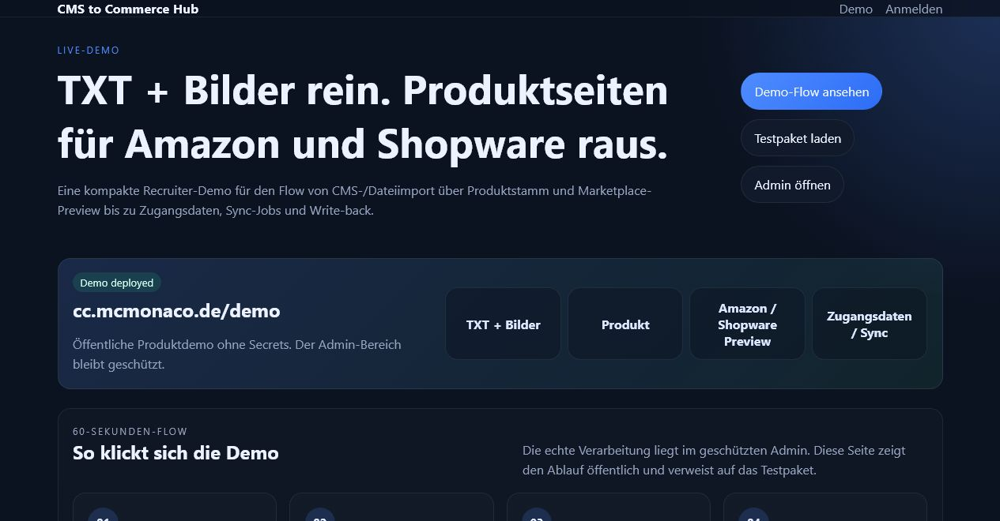
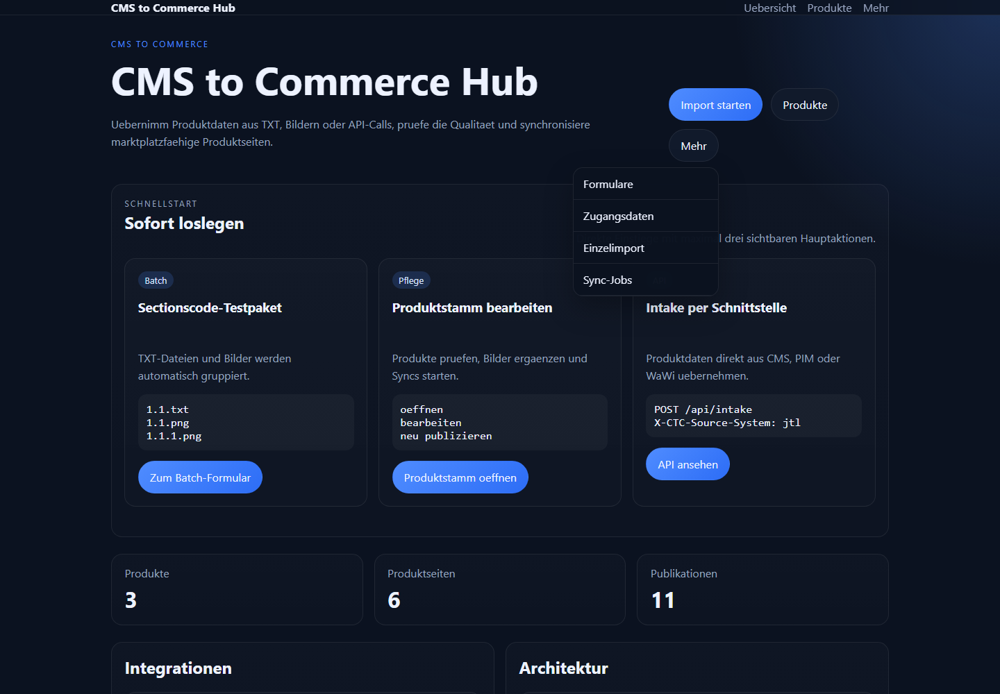
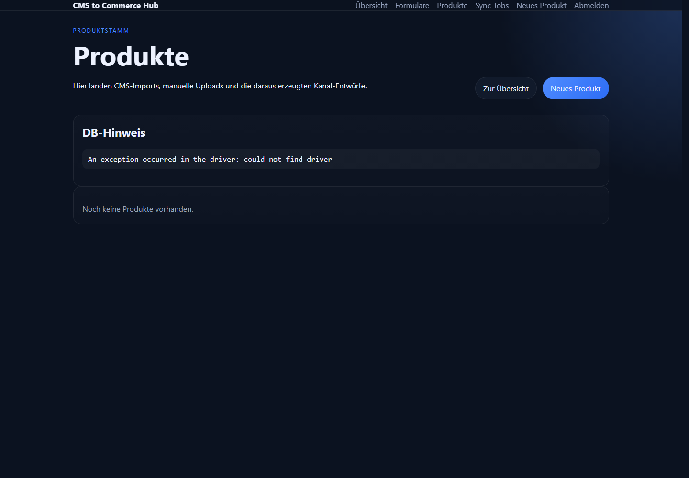
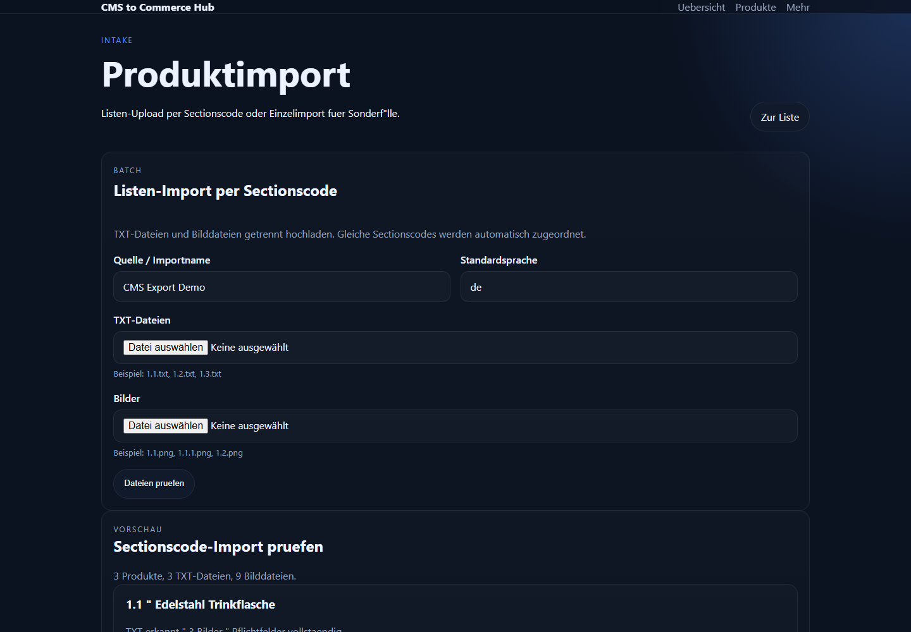
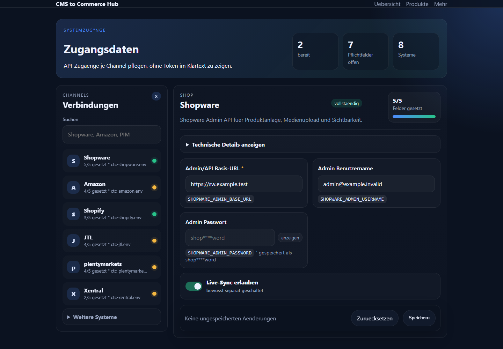
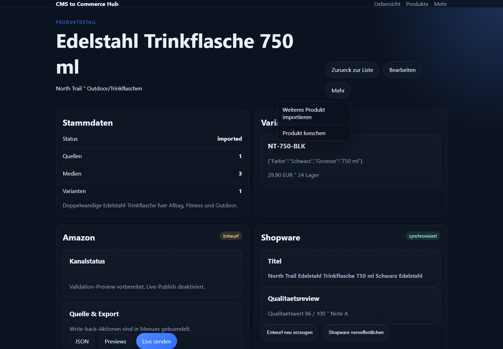
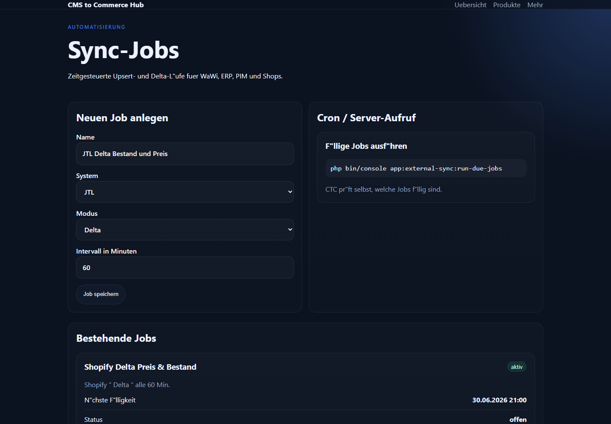

# Recruiter-Überblick: CMS to Commerce Hub

Dieses Repository zeigt eine produktnahe Symfony-Plattform für Commerce-Workflows: Produktdaten werden aus Uploads, CMS-, PIM-, ERP- und Warenwirtschaftsquellen übernommen, normalisiert, mit Medien verbunden und anschließend als hochwertige Amazon- und Shopware-Listings vorbereitet.

Der Fokus liegt nicht auf einer kleinen Demo-Seite, sondern auf einer sauberen Integrationsarchitektur: sichere Konfiguration, nachvollziehbare Sync-Läufe, erweiterbare Adapter und ein UI, mit dem Fachanwender Produktdaten prüfen können.

Live-Demo: [cc.mcmonaco.de/demo](https://cc.mcmonaco.de/demo)

## Kurzprofil

| Bereich | Umsetzung |
| --- | --- |
| Backend | PHP 8.2+, Symfony 7.4, Doctrine ORM, Symfony Console |
| Frontend | Twig, Asset Mapper, responsive Admin-Oberfläche |
| Datenmodell | Produkte, Varianten, Medien, Quellen, Channel-Listings, Publication Runs, Sync-Jobs |
| Integrationen | Shopware Admin API, Amazon SP-API vorbereitet, JTL, plentymarkets, Xentral, SAP R/3, Pimcore, Shopify |
| Qualität | PHPUnit-Tests, Twig-/Container-Linting, sichere Dummy-Konfigurationen |
| Betrieb | Servervariablen/private Config statt Secrets im Repository, Deployment- und DB-Migrationscheck |

## Was das Projekt demonstriert

- Architektur für reale Commerce- und Marktplatzprozesse
- saubere Trennung zwischen Controller, Services, Integrationen und DTOs
- produktnahe UI statt reiner API-Demo
- sichere Vorbereitung externer Live-Schnittstellen mit Preview- und Sperrlogik
- robuste Importlogik für TXT-Dateien, Bilder, API-Payloads, Varianten und Medien
- technische Dokumentation, Tests und Deployment-Routine
- reduziertes Admin-UX-Konzept mit maximal drei sichtbaren Hauptaktionen pro Bereich

## Funktionsumfang

### Produkt- und Importworkflow

- manueller Einzelimport für Produktdaten
- Sectionscode-Import mit separaten TXT- und Bilddateien
- Medienzuordnung und Bildreihenfolge
- Produktstamm mit Quellen, Varianten und Assets
- Bearbeiten und Löschen von Produkten

### Listing-Erzeugung

- Amazon-A-Listing-Drafts mit Titel, Bulletpoints, Beschreibung, Keywords und Qualitätsprüfung
- Shopware-kompatible Produktdaten mit Medienzuordnung
- kanalbezogene JSON-Exports
- Qualitäts-Score und Hinweise auf Pflichtdatenlücken

### Integrationsarchitektur

| System | Rolle in CTC |
| --- | --- |
| Shopware | Produkt- und Medienexport über Admin API |
| Amazon | SP-API-Payloads, Product-Type-Mapping und Validation-Preview |
| JTL | Artikel-Intake, Delta-Sync, Write-back-Preview und gesperrter Live-Write-back |
| plentymarkets | Variantendaten, Preis/Bestand, Variationstexte und Live-Write-back-Vorbereitung |
| Xentral | ERP-/Prozessdaten, Varianten, Preis/Bestand und Preview |
| SAP R/3 | Materialstamm-nahe Payloads, IDoc-/BAPI-Preview, Gateway-Proxy-Vorbereitung |
| Pimcore | PIM/DAM-Intake, localized fields, Assets, Classification-Attribute und Objekt-Write-back |
| Shopify | Admin-API-Intake, Produkt-/Variantendaten, Bilder, SEO-Felder und GraphQL-Write-back |

## Screenshots

### Öffentliche Demo



### Demo-Flow


### Dashboard



### Produktübersicht



### Import



### Zugangsdaten-Portal



### Produktdetail



### Sync-Jobs



## Technische Highlights

### Senior-Level Engineering-Signale

- Controller bleiben dünn; Import, Listing-Erzeugung, Publishing und externe Systeme liegen in separaten Services.
- Kanal-Previews sind von Live-Schreibvorgängen getrennt, damit Integrationen testbar und sicher bleiben.
- Secrets werden über Servervariablen oder private `ctc-*.env` Dateien geladen, nicht aus GitHub.
- Fehlerfälle werden als Sync-/Publication-Runs sichtbar statt still verschluckt.
- CI prüft Composer, Symfony-Container, Twig-Templates und PHPUnit.
- Architektur- und Operations-Doku zeigen nicht nur Features, sondern Betrieb, Risiken und Trade-offs.

### Erweiterbare Adapter-Struktur

Neue Systeme werden über denselben Ablauf eingebunden:

1. Payload erkennen
2. Daten normalisieren
3. Medien übernehmen
4. Variantenmodell auflösen
5. Delta-Sync vorbereiten
6. Write-back-Preview erzeugen
7. Live-Schreiben erst nach expliziter Serverfreigabe aktivieren

Dadurch sind sehr unterschiedliche Systeme wie JTL, SAP R/3 und Pimcore konsistent nutzbar.

### Sichere Live-Schnittstellen

Produktive Zugangsdaten liegen nicht im Git-Repository. CTC liest sensible Werte aus globalen Servervariablen oder privaten Dateien außerhalb des Projektordners.

Admins koennen channel-spezifische Zugangsdaten ausserdem ueber das Portal unter `/credentials` pflegen. Die Werte werden in private `ctc-*.env` Dateien geschrieben, im Formular maskiert angezeigt und beim Leerlassen nicht ueberschrieben.

Live-Aktionen sind zusätzlich über explizite Flags geschützt, zum Beispiel:

```env
AMAZON_ENABLE_LIVE_PUBLISH=0
JTL_ENABLE_LIVE_WRITEBACK=0
PLENTY_ENABLE_LIVE_WRITEBACK=0
SAP_R3_ENABLE_LIVE_WRITEBACK=0
PIMCORE_ENABLE_LIVE_WRITEBACK=0
```

### Testbarkeit

Die Integrationen sind so gebaut, dass sie ohne echte externe Systeme testbar bleiben. HTTP-Clients werden gemockt, Live-Schreibvorgänge bleiben per Default deaktiviert und Payloads können als Preview geprüft werden.

Aktueller Stand nach der UX- und Credential-Portal-Erweiterung:

```text
54 Tests / 462 Assertions
```

## Warum das für Recruiter interessant ist

Dieses Projekt zeigt mehrere Fähigkeiten, die im Alltag von Produkt-, Plattform- und Integrationsentwicklung wichtig sind:

- Verständnis für E-Commerce-Prozesse und Marktplatzanforderungen
- API-Design und Integrationsdenken über mehrere externe Systeme hinweg
- Umgang mit Legacy-/Enterprise-Systemen wie SAP R/3
- moderne Symfony-Entwicklung mit Services, DTOs, Commands und Tests
- Sicherheitsbewusstsein bei Secrets, Live-Schreibvorgängen und Deployment
- Fähigkeit, aus unscharfen Anforderungen ein klickbares Produkt zu bauen

## Kleine Codebeispiele statt langer Code-Seiten

### Datei-Import

```text
1.1.txt    -> Produktdaten
1.1.png    -> Hauptbild
1.1.1.png  -> Detailbild
1.2.txt    -> nächstes Produkt
```

### Service-Orchestrierung

```php
$product = $intakeManager->createFromInput($formData, $uploadedFiles);

foreach (ChannelType::cases() as $channel) {
    $publicationOrchestrator->prepare($product, $channel);
}
```

### Kanal-Preview

```text
GET /products/{id}/export/amazon
GET /products/{id}/export/shopware
```

Der Quellcode ist bewusst in Services, DTOs und Connectoren aufgeteilt. Für einen schnellen Review reichen die Beispiele oben; wer tiefer einsteigen möchte, findet die Fachlogik unter `src/Service` und die externen Adapter unter `src/Integration`.

## Lokaler Start

```bash
composer install && php bin/console doctrine:migrations:migrate && symfony server:start
```

Für lokale Entwicklung nutzt die committed `.env` nur Dummy- und Defaultwerte. Produktive Secrets gehören in Servervariablen oder nach `../private-config/ctc*.env`.

## Weiterführende Dokumentation

- [Architektur](architecture.md)
- [Integrations-Roadmap](integration-roadmap.md)
- [Betrieb, Deployment und Datenbank](operations.md)
- [Private Config Beispiel](private-config.example.env)
- [Server Environment Beispiel](server-env.example.apache.conf)
